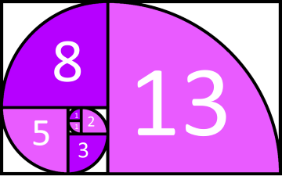

# Some Basic Problem in JavaScript

## Inch to Foot Converter - Summery

- divide the length value by 12.
- 1 foot is equal 12 inches.

  > Solution

```JavaScript
let inches = prompt('Inches', '0');
const inchToFoot = (num) => {
    let foot = num / 12;
    return `${num} inches = ${foot} foot.`;
}
let getFoot = inchToFoot(inches);
alert(getFoot);
```

## Foot to Inch Converter - Summery

- Multiply the length value by 12
- 1 foot is equal 12 inches.

> Solution

```JavaScript
let foots = prompt('Foots', '0');
const footToInches = (num) => {
    let inches = num * 12;
    return `${num} Foots = ${inches} Inches.`;
}
let getInches = footToInches(foots);
alert(getInches);
```

## Mile To Kilometer - Summery

- For an approximate result, multiply the length value by 1.609
- 1 mile is equal to 1.609

> Solution

```JavaScript
const mile = prompt('How many miles?', '');
const mileToKilo = (num) => {
    let kilo = (num * 1.609).toFixed(2);
    return `${num} Mile = ${kilo} Kilometer`;
}
let getKilo = mileToKilo(mile);
alert(getKilo)
```

## Kilometer to Mile - Summery

- For and approximate result, divide the length value by 1.609
- 1 mile is equal to 1.609

> Solution

```JavaScript
const kilo = prompt('How many kilo', '');
const kiloToMile = (num) => {
    let mile = (num / 1.609).toFixed(2);
    return `${num} Kilo = ${mile} Mile`;
}
let getMile = kiloToMile(kilo);
alert(getMile);
```

## A program to find the smallest number and the largest number in three numbers

> Approach number one.

```JavaScript
const minMax = (num1, num2, num3, minmax) => {
    if (minmax === 'max') {
        console.log(num1, num2, num3);
        if (num1 > num2 && num1 > num3) {
            return `Largest one is : ${num1}`;
        } else if (num2 > num1 && num2 > num3) {
            return `Largest one is : ${num2}`;
        } else {
            return `Largest one is : ${num3}`;
        }
    } else if (minmax === 'min') {
        console.log(num1, num2, num3);
        if (num1 < num2 && num1 < num3) {
            return `Smaller one is : ${num1}`;
        } else if (num2 < num1 && num2 < num3) {
            return `Smaller one is : ${num2}`;
        } else {
            return `Smaller one is : ${num3}`;
        }
    }
}

const smallNumber = minMax(10, 25, 24, 'max');
console.log(smallNumber);
const largestNumber = minMax(25, 30, 24, 'max')
console.log(largestNumber);
```

> Approach number two.

```JavaScript
const minMax = (num1, num2, num3, minmax) => {
    if (minmax === 'max') {
        console.log(num1, num2, num3);
        return `Largest one is: ${Math.max(num1, num2, num3)}`;
    } else if (minmax === 'min') {
        console.log(num1, num2, num3);
        return `Smaller one is: ${Math.min(num1, num2, num3)}`;
    }
}

const smallNumber = minMax(10, 25, 24, 'max');
console.log(smallNumber);
const largestNumber = minMax(25, 30, 24, 'max')
console.log(largestNumber);
```

## Summation of all numbers in an array

```JavaScript
// declare with initialize variable.
let name = 'Tusar'
  , marks = [78, 85, 87, 94, 99, 65, 77];

const sumOfArray = (name, numbers) => {
    let length = numbers.length
      , sum = 0;
    for (let i = 0; i < numbers.length; i++) {
        sum += numbers[i];
    };
    return `Student name: ${name}. Total marks: ${sum}`;
}

let summation = sumOfArray(name, marks);
console.log(summation);
```

## Largest or smaller number in an array

```JavaScript
const rollNumbers = [77, 10, 3, 9, 12, 45, 56];

const largestInArray = (numbers, largeSmall) => {
    let length = numbers.length
      , lowHigh = numbers[0];

    if (largeSmall === 'large') {
        for (let i = 0; i < length; i++) {
            let elem = numbers[i];
            if (lowHigh < elem) {
                lowHigh = elem;
            }
        }
    } else if (largeSmall === 'small') {
        for (let i = 0; i < length; i++) {
            let elem = numbers[i];
            if (lowHigh > elem) {
                lowHigh = elem;
            }
        }
    }
    return lowHigh;
}

const largeSmallRoll = largestInArray(rollNumbers, 'small');
console.log(largeSmallRoll);
```

## Fibonacci Number

> The Fibonacci sequence is the series of numbers where each number is the sum of the two preceding numbers. For example, 0, 1, 1, 2, 3, 5, 8, 13, 21, 34, 55, 89, 144, 233, 377, 610



> Approach one

```JavaScript
let series = '0 1 '
  , num = 0
  , x = 0
  , y = 1;

for (let i = 0; i < 10; i++) {
  num = x + y;
  x = y;
  y = num;
  series += num + ' ';
}

console.log(series);
```

> Approach Two

```JavaScript
const fibo = [0, 1];
for (let i = 2; i < 10; i++) {
  fibo[i] = fibo[i - 1] + fibo[i - 2];
}
console.log(fibo);
```

## Area Of Triangle - Heron's Formula

```JavaScript
const areaOfTriangle = (a, b, c) => {
  // Calculate Semi-perimeter
  let s = (a + b + c) / 2;
  let calculateArea = s * (s - a) * (s - b) * (s - c);
  console.log(calculateArea);
  let area = Math.sqrt(calculateArea).toFixed(2);
  return +area;
};

let sideA = +prompt("Enter the value of : Side A"),
  sideB = +prompt("Enter the value of : Side B"),
  sideC = +prompt("Enter the value of : Side C");

const area = areaOfTriangle(sideA, sideB, sideC);
alert(area);
```

## Multiplication Table

```JavaScript
const multiplicationTable = number => {
    let mulTable = '';
    for (let i = 1; i <= 10; i++) {
        mulTable += `${number} x ${i} = ${i * number} \n`;
    }
    return mulTable;
}
const userNeed = +prompt('Enter the valid number', '');
const tableOfMultiplication = multiplicationTable(userNeed);
console.log(tableOfMultiplication);
```

## Feet To Mile

```JavaScript
const footToMiles = number => {
    const mile = number / 5280;
    return mile;
}
const getMiles = footToMiles(2000);
console.log(getMiles);
```